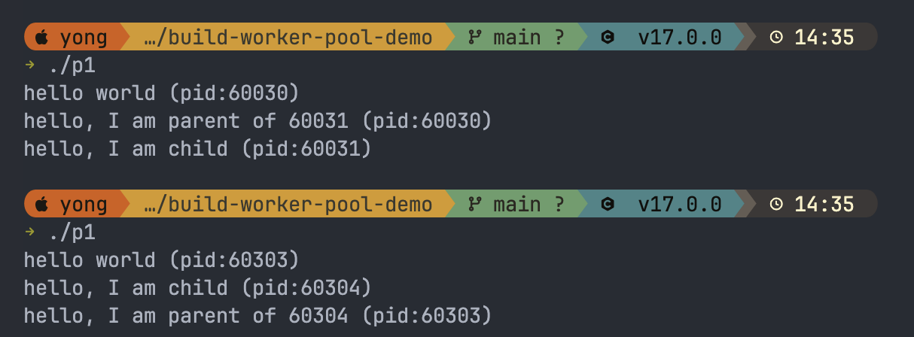

# build-worker-pool-demo

### 如何執行 C 語言檔案?

C 語言需要先編譯

1. 把程式碼存成檔案（例如 p1.c）
2. 編譯
   `gcc -o p1 p1.c`
3. 執行
   `./p1`

macOS 內建 clang（透過 Xcode Command Line Tools），gcc 指令實際上會呼叫 clang，兩者都能用。

### 什麼是 non-deterministic？

輸出順序不確定。同一支程式跑多次，父程序和子程序誰先印出是隨機的，取決於 OS 的 CPU scheduler 當下怎麼排程。

