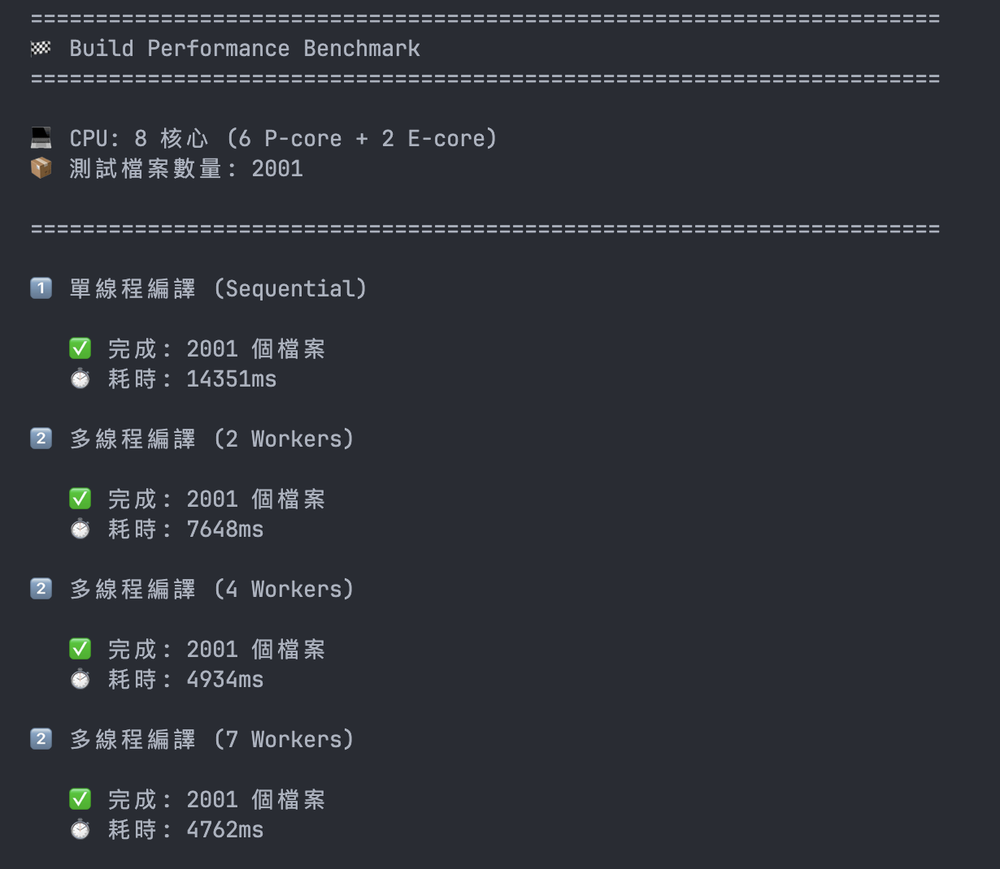

# Build Worker Pool Demo

透過 Node.js 實作，學習作業系統（OS）的 Process API 核心概念。

從 OSTEP（Operating Systems: Three Easy Pieces）的 `fork()`、`wait()`、`exec()` 出發，用 Node.js 的 `child_process.fork()` 模擬多程序協作，最終實作一個平行編譯的 Worker Pool，體會教科書理論在實際工程中的應用。

## OS Process API 與 Node.js 的對應

| OS 概念    | C 語言 API               | Node.js 對應                               | 本專案用法               |
| ---------- | ------------------------ | ------------------------------------------ | ------------------------ |
| 建立子程序 | `fork()`                 | `child_process.fork()`                     | 建立 worker 子程序       |
| 程序間通訊 | `pipe()` / shared memory | `process.send()` / `process.on("message")` | 派發任務、回報結果       |
| 等待子程序 | `wait()` / `waitpid()`   | Promise + event listener                   | 等待所有編譯完成         |
| 替換程式   | `exec()`                 | 隱含在 `fork()` 中（見下方說明）           | 載入 worker JS 檔案      |
| 終止程序   | `kill()`                 | `process.kill()`                           | `shutdown()` 清理 worker |

### 關鍵差異

- C 的 `fork()` 只複製程序記憶體（COW），要執行不同程式需另外呼叫 `exec()`。Node.js 的 `child_process.fork()` 底層是 `spawn('node', [modulePath])`，等同於 OS 層級的 `fork() + exec(node)`，一步完成建立子程序與載入新腳本
- C 用 `pipe()` 或 shared memory 做 IPC，Node.js 內建 `send()`/`on("message")` 基於序列化的訊息傳遞
- C 需要手動 `wait()` 回收 zombie process，Node.js 由 runtime 管理，但仍需 `process.kill()` 清理

## 專案結構

```
.
├── phase1-basic/          # Phase 1：基礎 Worker Pool
│   ├── worker.js          # Worker 子程序（CPU 密集計算）
│   ├── simple-worker-pool.js  # Worker Pool 管理器
│   └── test-basic.js      # 測試入口
│
├── phase2-build/          # Phase 2：實際 Babel 編譯場景
│   ├── compile-worker.js  # 編譯 Worker（Babel 轉譯）
│   ├── build-pool.js      # BuildWorkerPool（進化版）
│   ├── benchmark.js       # 效能比較（單線程 vs 多線程）
│   └── src/               # 測試源碼（~2000 個 JSX 檔案）
│
├── phase3-comparison/     # Phase 3：與 Webpack 比較
│   ├── sequential-babel.js
│   ├── benchmark.js
│   └── webpack-config/
│
├── process_api_notes.md   # Process API 觀念筆記
└── process_api_practice.md # OSTEP Chapter 5 練習（C 語言）
```

## Phase 1：基礎 Worker Pool

**用意**：用最簡單的例子展示為什麼需要多程序。

Node.js 是 single-threaded，一次只能做一件 CPU 密集的事。當有 10 個耗時計算，單線程只能排隊一個一個跑，但 `fork()` 可以開多個子程序同時處理。

學到的核心觀念：

- **IPC（程序間通訊）**：parent 用 `send()` 派任務，child 用 `send()` 回傳結果
- **Worker Pool 模式**：預先建好固定數量的 worker，用佇列分派任務，完成後自動接下一個
- 這是 Phase 2 的**概念驗證（POC）**

```bash
node phase1-basic/test-basic.js
```

## Phase 2：實際 Build 場景

**用意**：把 Phase 1 的 Worker Pool 套用到 Babel 編譯，用 benchmark 量化效能差異。

Phase 1 的假計算換成 `babel.transformSync`，Worker Pool 機制完全相同。Benchmark 比較三個方案：

| 方案                | 說明                                 |
| ------------------- | ------------------------------------ |
| 單線程              | 主程序逐一編譯                       |
| 多線程 (2W / 4W)    | fork 固定數量的 worker               |
| 多線程 (自動核心數) | worker 數量 = `os.cpus().length - 1` |

學到的核心觀念：

- **從 POC 到實際應用**：worker 只需把假計算換成 Babel，pool 機制不變
- **Worker 數量 vs 效能**：不是越多越快，受限於 CPU 架構（P-core / E-core），超過物理核心數後效能不再提升
- **公平比較**：三個方案編譯相同檔案、輸出到獨立目錄（`dist/single/`、`dist/multi-Nw/`）

```bash
node phase2-build/benchmark.js
```

## 執行方式

```bash
# 安裝依賴
npm install

# Phase 1：基礎測試
node phase1-basic/test-basic.js

# Phase 2：效能比較
node phase2-build/benchmark.js
```

## Result




## Reference

- [OSTEP - Operating Systems: Three Easy Pieces](https://pages.cs.wisc.edu/~remzi/OSTEP/)
- [Node.js child_process.fork() 文件](https://nodejs.org/api/child_process.html#child_processforkmodulepath-args-options)
