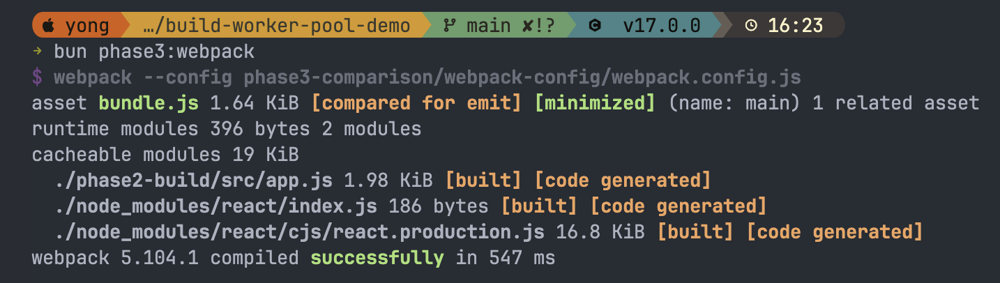

```
build-worker-pool-demo/
├── package.json
├── .gitignore
├── README.md
│
├── phase1-basic/              # Phase 1: 基礎概念
│   ├── simple-worker-pool.js
│   ├── worker.js
│   └── test-basic.js
│
├── phase2-build/              # Phase 2: 實際編譯
│   ├── build-pool.js
│   ├── compile-worker.js
│   ├── src/                   # 模擬的源碼
│   │   ├── app.js
│   │   ├── utils.js
│   │   ├── component.jsx
│   │   └── ... (10+ 檔案)
│   └── dist/                  # 編譯輸出
│
├── phase3-comparison/         # Phase 3: 工具對照
│   ├── webpack-config/
│   │   ├── webpack.config.js
│   │   └── with-workers.js
│   ├── vite-config/
│   │   └── vite.config.js
│   └── benchmark.js           # 效能比較
│
└── docs/                      # 學習筆記
    ├── concepts.md
    └── performance.md
```

# （一）

#### 1. 建立專案結構

```
mkdir build-worker-pool-demo && cd build-worker-pool-demo
```

#### 2. 初始化並安裝依賴

```js
npm init -y
npm install # 根據上面的 package.json
```

#### 3. 建立 Phase 1 檔案

複製上面的 simple-worker-pool.js, worker.js, test-basic.js

#### 4. 執行測試

npm run phase1

#### 5. 實驗: 改變 worker 數量

編輯 test-basic.js,試試 1, 2, 4, 8 個 workers

# （二）

#### 1. 建立 Phase 2 檔案

`mkdir -p phase2-build/src`

#### 2. 建立測試源碼

複製上面的 build-pool.js, compile-worker.js

#### 3. 產生測試檔案

```js
for i in {1..20}; do
cp phase2-build/src/app.js phase2-build/src/file$i.js
done
```

#### 4. 執行編譯

`npm run phase2`

#### 5. 查看輸出

`ls -lh phase2-build/dist/`

#### 1. 建立 Webpack 設定

複製上面的 webpack config 檔案

#### 2. 比較執行

```js
npm run phase3:webpack
npm run phase3:webpack-workers
```

#### 3. 執行 benchmark

`npm run phase2:benchmark`




## 為什麼有時 4w > 7w？

4W 和 7W 的結果幾乎一樣（2949 vs 2963，差距 <1%，屬於正常波動）。

你的機器是 6 P-core + 2 E-core（總共 8 核）。

那 4W ≈ 7W 的原因修正一下：6 個 P-core 就夠處理 1001 個檔案了，額外 1 個 E-core worker
幫助有限，而且 7 個 worker 之間的 IPC 排程開銷抵消了多出來的算力。4W 和 7W
在這個量級差距本來就會很小。

## 比較

 bun phase2:benchmark
$ node phase2-build/benchmark.js
======================================================================
🏁 Build Performance Benchmark
======================================================================

💻 CPU: 8 核心 (6 P-core + 2 E-core)
📦 測試檔案數量: 2001

======================================================================

1️⃣ 單線程編譯 (Sequential)

✅ 完成: 2001 個檔案
⏱️ 耗時: 14847ms

2️⃣ 多線程編譯 (2 Workers)

✅ 完成: 2001 個檔案
⏱️ 耗時: 8586ms

2️⃣ 多線程編譯 (4 Workers)

✅ 完成: 2001 個檔案
⏱️ 耗時: 5838ms

2️⃣ 多線程編譯 (7 Workers)

✅ 完成: 2001 個檔案
⏱️ 耗時: 4631ms

======================================================================
📊 效能比較結果
======================================================================

## 方法 | 耗時(ms) | 相對速度 | 評級

單線程 | 14847 | 3.21x | 👎
多線程 (2W) | 8586 | 1.85x | 👍
多線程 (4W) | 5838 | 1.26x | ⭐
多線程 (7W) | 4631 | 1.00x | 🏆 ← 最快!
======================================================================

💡 與單線程相比:
多線程 (2W): 快 42.2%
多線程 (4W): 快 60.7%
多線程 (7W): 快 68.8%

======================================================================

💭 建議:
✅ 多線程 (7W) 表現最佳
對於這個檔案數量,使用 workers 是值得的


